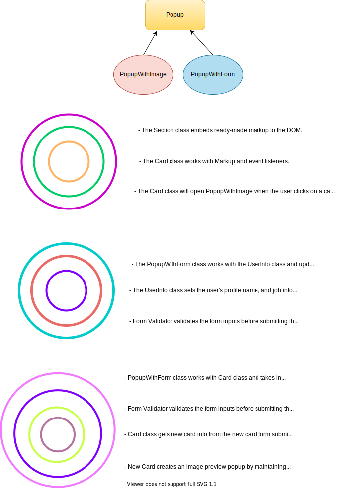

# Project 4: Around The U.S.

This is an interactive page which users can add, remove, or like their travel photos.

- Users can edit their profile with the Edit Profile Modal, add new places to the list, remove the card from their list.
- Profile form and add new card forms are checking the input values by validating the length of the input. (JS ValidityState)
- Users can close the modals by pressing Esc key or by clicking outside the modal.

Technologies and concepts:

- HTML,
- CSS, Responsive Design,
- Figma,
- BEM Methodology,
- Webpack Bundler, JS transpilation and minification, CSS minification and autoprefixing, Image and font processing
- Javascript Module System, ES6,
- OOP - Loose coupling, Encapsulation, Inheritance,and Polymorphism
- Interface accessibility

## Classes

- Section
- Card
- FormValidator
- UserInfo
- Popup class is a parent class for the subclasses of PopupWithImage and PopupWithForm

## Project Layers



## Installation

```bash
git clone https://github.com/hulyak/web_project_4.git

npm install

npm run build # builds the project

npm run dev # open the project in the browser localhost:8080

```

**Figma Links**

- [Figma 1](https://www.figma.com/file/NYoOgIJw6t8pYuN51ceqMo/Sprint-4-Around-The-U.S.-desktop-mobile)
- [Figma 2](https://www.figma.com/file/XCcf9aRKy1L0guhQxQPINs/Sprint-5-Around-The-U.S.-desktop-mobile?node-id=0%3A1)
- [Figma 3-Form Validation](https://www.figma.com/file/fZVKeuZhBNydDFXsfM0m2d/Sprint-6%3A-Around-The-U.S.)
