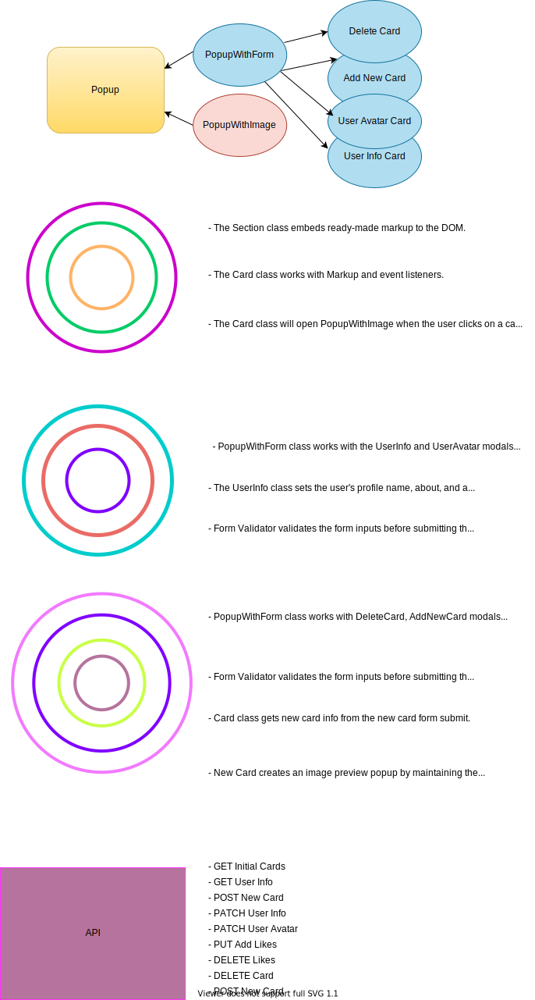

# Around The U.S.

- This is an interactive page that the user can add, remove, or like their travel photos. They can also see other users' photos and like other users' photos.
- The user can update their profile avatar and user information.
- The user can like the cards or dislike them by toggling the heart icon. Likes are counted.
- If the user wants to delete the card, they can click the bin icon. They will be  prompted to confirm the deletion.
- The user can only remove their pictures not other users. The bin icon appears only on the user's cards.
- When the user submits the form, while they're waiting for the data, loading text will be shown to the user.
- Forms are checking the input values by validating the length of the input. (JS ValidityState)
- Users can close the modals by pressing the Esc key or by clicking outside the modal.

### [See it live!](https://hulyak.github.io/web_project_4/)

Technologies and concepts:

- `HTML`, `CSS`, Responsive Design, BEM Methodology, Interface accessibility
- Template Cloning, Form Validation
- `Figma`,
- `Webpack` Bundler, JS transpilation and minification, CSS minification and autoprefixing, Image and font processing,
- Javascript Module System, ES6, Babel compiler
- `OOP` - Loose coupling, Encapsulation, Inheritance,and Polymorphism
- `API` interaction, communication with the server
- `Dotenv` and `dotenv-webpack` to hide credentials
- Offline functionality is implemented through `Service Workers` and [`Workbox`](https://developers.google.com/web/tools/workbox/guides/get-started).


## Installation

```bash
git clone https://github.com/hulyak/web_project_4.git

npm install  # install dependencies

npm run build # builds the project

npm run dev # open the project in the browser localhost:8080

```


**Figma Links**

- [Sprint 4 -> Figma 1](https://www.figma.com/file/NYoOgIJw6t8pYuN51ceqMo/Sprint-4-Around-The-U.S.-desktop-mobile)
- [Sprint 5 ->  Figma 2 X Forms and Image Preview popup](https://www.figma.com/file/XCcf9aRKy1L0guhQxQPINs/Sprint-5-Around-The-U.S.-desktop-mobile?node-id=0%3A1)
- [Sprint 6 -> Figma 3 X Form Validation](https://www.figma.com/file/fZVKeuZhBNydDFXsfM0m2d/Sprint-6%3A-Around-The-U.S.)
- [Sprint 9 -> Figma 4 X Confirmation Box, Form Loading State, Update Avatar, Change Profile Picture](https://www.figma.com/file/aA7G480LERxFpyY9xskHDb/Sprint-9-Applied-JavaScript?node-id=0%3A1)

## Sprint 7 -> Classes

- Section wrapper
- Card
- FormValidator
- UserInfo
- Popup class is a parent class for the subclasses of PopupWithImage and PopupWithForm
- Api class for storing API calls

## Sprint 8 -> Project Layers


